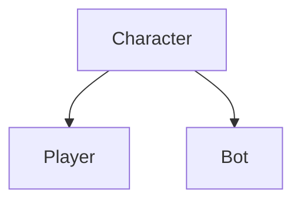

21:9

	OnInit
	OnDespawn
	OnDeath
	SetData
	OnKill
	Attack
		SetAnim
		SpawnBullet
		SetActiveWp
	OnKill
	Move
	UpSize
	DetectEnemy
		OntriggerEnter/Exit -> Add/Delete from list
	ChangeWeapon

GameManager
	GameState
LevelManager
	List<Character> (check exist -> don't add)
UIManager
SoundManager
VFXManager

Data
	UserData
	LocalData Scriptable Object